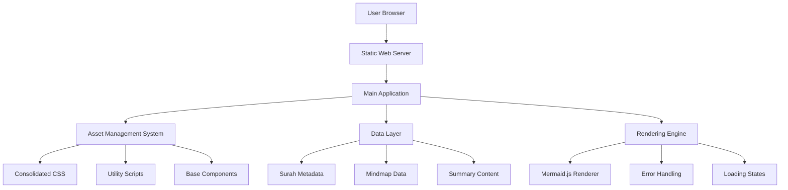
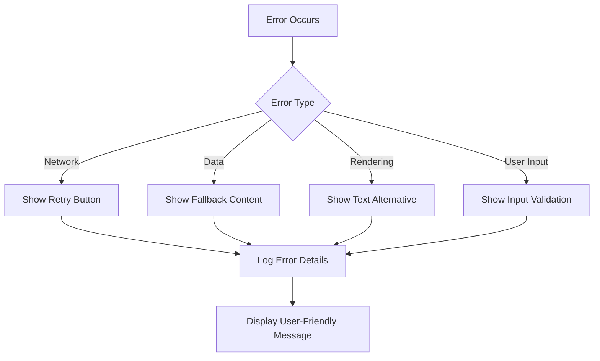
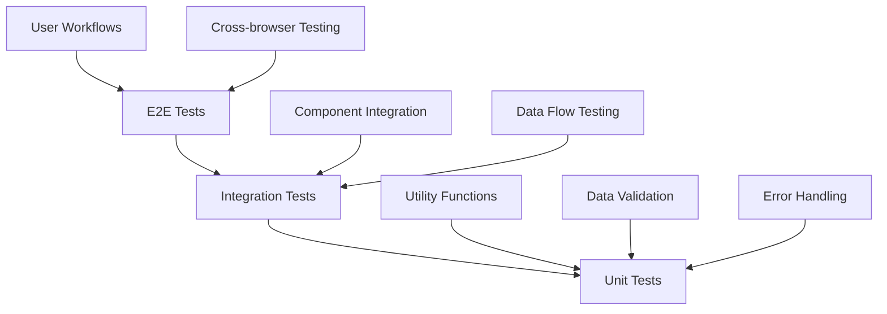
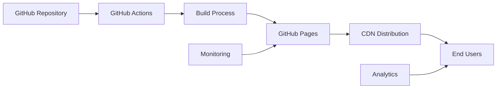

# Design Document

## Overview

The Quran Mindmap Enhancement project aims to transform the existing codebase into a maintainable, secure, and performant web application. The design focuses on consolidating duplicate code, standardizing on modern web technologies, and implementing robust error handling while maintaining the core functionality of providing interactive Quran study through mindmaps.

## Architecture

### High-Level Architecture



### Component Architecture

The application will be restructured into a modular component system:

1. **Core Layer**: Base utilities and shared functionality
2. **Data Layer**: JSON data management and API abstraction
3. **Presentation Layer**: UI components and rendering logic
4. **Application Layer**: Page-specific logic and routing

## Components and Interfaces

### 1. Asset Management System

**Purpose**: Centralize and optimize all static assets

**Components**:
- `assets/css/main.css` - Consolidated stylesheet
- `assets/js/utils.js` - Shared utility functions
- `assets/js/surah-base.js` - Base Surah page functionality

**Interface**:
```javascript
// Utils Interface
interface Utils {
  fetchJSON(url: string): Promise<any>
  showError(message: string): void
  showLoading(): void
  hideLoading(): void
  updateSurahPageTitle(surah: Surah): void
  debounce(func: Function, wait: number): Function
}

// Surah Base Interface
interface SurahBase {
  initializePage(): Promise<void>
  createMermaidMindmap(surah: Surah, summary?: SurahSummary): Promise<void>
  handleError(error: Error): void
}
```

### 2. Data Management Layer

**Purpose**: Provide consistent data access and validation

**Components**:
- Data validation schemas
- Caching mechanisms
- Error recovery strategies

**Interface**:
```javascript
interface DataManager {
  getAllSurahs(): Promise<Surah[]>
  getSurahById(id: string): Promise<Surah | null>
  getSurahSummaries(): Promise<SurahSummary[]>
  validateData(data: any, schema: Schema): boolean
}

interface Surah {
  number: number
  name: string
  englishName: string
  englishNameTranslation: string
  numberOfAyahs: number
  revelationType: 'Meccan' | 'Medinan'
}

interface SurahSummary {
  id: string
  name: string
  summary: string
  mindmapData?: MindmapNode[]
}
```

### 3. Rendering Engine

**Purpose**: Standardize mindmap rendering and UI updates

**Components**:
- Mermaid.js integration
- Dynamic content generation
- Responsive layout management

**Interface**:
```javascript
interface RenderEngine {
  renderMindmap(container: HTMLElement, data: MindmapData): Promise<void>
  updatePageTitle(title: string): void
  showLoadingState(container: HTMLElement): void
  hideLoadingState(container: HTMLElement): void
  displayError(container: HTMLElement, error: Error): void
}

interface MindmapData {
  title: string
  nodes: MindmapNode[]
  theme?: string
  layout?: 'horizontal' | 'vertical'
}
```

### 4. Security Layer

**Purpose**: Implement XSS prevention and content sanitization

**Components**:
- Input sanitization functions
- Safe DOM manipulation utilities
- Content Security Policy enforcement

**Interface**:
```javascript
interface SecurityManager {
  sanitizeText(input: string): string
  createSafeElement(tagName: string, content: string): HTMLElement
  validateExternalContent(content: any): boolean
  enforceCSP(): void
}
```

## Data Models

### Surah Data Structure

```json
{
  "number": 1,
  "name": "سُورَةُ ٱلْفَاتِحَةِ",
  "englishName": "Al-Faatiha",
  "englishNameTranslation": "The Opening",
  "numberOfAyahs": 7,
  "revelationType": "Meccan",
  "metadata": {
    "themes": ["praise", "guidance", "worship"],
    "keyVerses": [1, 6, 7],
    "relatedSurahs": []
  }
}
```

### Enhanced Mindmap Data Structure

```json
{
  "id": "al-fatiha",
  "name": "Al-Fatiha",
  "summary": "The Opening chapter...",
  "mindmapData": {
    "root": {
      "id": "root",
      "title": "Al-Fatiha",
      "children": [
        {
          "id": "themes",
          "title": "Key Themes",
          "children": [
            {"id": "praise", "title": "Praise to Allah"},
            {"id": "guidance", "title": "Seeking Guidance"},
            {"id": "worship", "title": "Pure Worship"}
          ]
        }
      ]
    }
  }
}
```

## Error Handling

### Error Categories

1. **Network Errors**: Failed data fetching
2. **Data Errors**: Malformed or missing JSON
3. **Rendering Errors**: Mermaid.js failures
4. **User Input Errors**: Invalid search queries

### Error Handling Strategy



### Error Recovery Mechanisms

1. **Automatic Retry**: For transient network failures
2. **Graceful Degradation**: Show basic content when advanced features fail
3. **User Feedback**: Clear error messages with actionable steps
4. **Logging**: Comprehensive error tracking for debugging

## Testing Strategy

### Testing Pyramid



### Test Coverage Goals

- **Unit Tests**: 90% coverage for utility functions
- **Integration Tests**: 80% coverage for component interactions
- **E2E Tests**: 100% coverage for critical user paths

### Testing Tools

- **Unit Testing**: Jest or Vitest
- **Integration Testing**: Testing Library
- **E2E Testing**: Cypress or Playwright
- **Performance Testing**: Lighthouse CI

## Performance Optimization

### Loading Strategy

1. **Critical Path Optimization**:
   - Inline critical CSS
   - Defer non-critical JavaScript
   - Optimize font loading

2. **Resource Management**:
   - Consolidate CSS files
   - Minimize JavaScript bundles
   - Implement lazy loading for images

3. **Caching Strategy**:
   - Browser caching for static assets
   - Service worker for offline functionality
   - CDN integration for external libraries

### Performance Metrics

- **First Contentful Paint**: < 1.5s
- **Largest Contentful Paint**: < 2.5s
- **Cumulative Layout Shift**: < 0.1
- **First Input Delay**: < 100ms

## Security Considerations

### XSS Prevention

1. **Input Sanitization**: All user input sanitized before processing
2. **Safe DOM Manipulation**: Use textContent instead of innerHTML
3. **Content Security Policy**: Strict CSP headers
4. **Library Security**: Regular dependency updates

### Implementation Details

```javascript
// Safe content insertion
function safeSetContent(element, content) {
  // Sanitize content
  const sanitized = DOMPurify.sanitize(content);
  
  // Use safe DOM methods
  element.textContent = sanitized;
}

// CSP Configuration
const cspPolicy = {
  'default-src': "'self'",
  'script-src': "'self' 'unsafe-inline' cdn.jsdelivr.net",
  'style-src': "'self' 'unsafe-inline'",
  'img-src': "'self' data:",
  'connect-src': "'self'"
};
```

## Accessibility Implementation

### WCAG 2.1 AA Compliance

1. **Semantic HTML**: Proper heading hierarchy and landmarks
2. **Keyboard Navigation**: Full keyboard accessibility
3. **Screen Reader Support**: ARIA labels and descriptions
4. **Color Contrast**: Minimum 4.5:1 ratio for normal text
5. **Focus Management**: Visible focus indicators

### Implementation Examples

```html
<!-- Accessible Surah Card -->
<div class="surah-item" role="button" tabindex="0" 
     aria-label="Surah Al-Fatiha, 7 verses, Meccan">
  <h3 id="surah-1-title">Al-Fatiha</h3>
  <p aria-describedby="surah-1-title">The Opening</p>
</div>

<!-- Accessible Mindmap -->
<div class="mermaid-container" role="img" 
     aria-label="Mindmap showing themes of Surah Al-Fatiha">
  <!-- Mermaid content -->
</div>
```

## Mobile Responsiveness

### Responsive Design Strategy

1. **Mobile-First Approach**: Design for mobile, enhance for desktop
2. **Flexible Grid System**: CSS Grid and Flexbox
3. **Touch-Friendly Interactions**: Minimum 44px touch targets
4. **Performance Optimization**: Reduced payload for mobile

### Breakpoints

```css
/* Mobile First */
.surah-grid {
  display: grid;
  grid-template-columns: 1fr;
  gap: 1rem;
}

/* Tablet */
@media (min-width: 768px) {
  .surah-grid {
    grid-template-columns: repeat(2, 1fr);
  }
}

/* Desktop */
@media (min-width: 1024px) {
  .surah-grid {
    grid-template-columns: repeat(auto-fill, minmax(250px, 1fr));
  }
}
```

## Migration Strategy

### Phase 1: Foundation (Completed)
- ✅ Consolidate CSS files
- ✅ Fix security vulnerabilities
- ✅ Standardize on Mermaid.js
- ✅ Create utility functions

### Phase 2: Enhancement
- Implement comprehensive error handling
- Add loading states and user feedback
- Enhance mobile responsiveness
- Implement accessibility features

### Phase 3: Optimization
- Add testing infrastructure
- Implement build process
- Add performance monitoring
- Optimize for Core Web Vitals

### Phase 4: Advanced Features
- Offline functionality
- Advanced search capabilities
- User preferences
- Analytics integration

## Deployment Architecture

### Static Site Hosting



### Build Pipeline

1. **Code Quality Checks**: ESLint, Prettier
2. **Testing**: Unit, integration, and E2E tests
3. **Asset Optimization**: Minification, compression
4. **Deployment**: Automated deployment to GitHub Pages
5. **Monitoring**: Performance and error tracking

This design provides a comprehensive foundation for transforming the Quran Mindmap application into a modern, maintainable, and user-friendly web application while preserving its core educational mission.